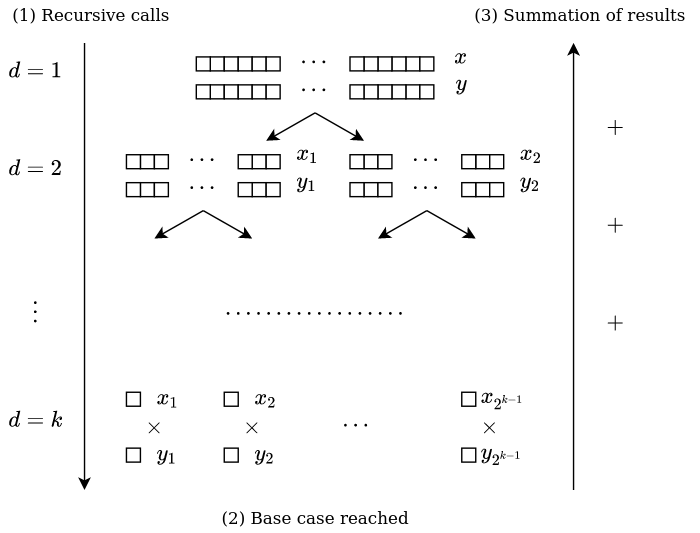

# vfc_ci_tutorial

This is a tutorial repository for the CI functionality of
[Verificarlo](https://github.com/verificarlo/verificarlo). It describes how to
setup the CI pipeline and generate the report on a simple example.

The code executes a basic dot product on two vectors of size 512 generated with
a fixed seed. The computation is done with a naive method, and the
implementation can be found at the beginning of `main.c`. The goal will be to
use Verificarlo CI to measure the numerical accuracy of the naive
implementation, before adding a better version of the algorithm and validating
it by comparing the results of the two versions.

Following this tutorial will require you to have a
[functional install of Verificarlo](https://github.com/verificarlo/verificarlo/blob/master/doc/01-Install.md)
on your machine, or to use it through its
[Docker image](https://hub.docker.com/r/verificarlo/verificarlo/).

For more information on the tool itself, please refer to the
[Verificarlo CI documentation](https://github.com/verificarlo/verificarlo/blob/master/doc/06-Postprocessing.md#verificarlo-ci).
It is advised that you at least go through it quickly before doing this
tutorial.

## Steps to follow

### 1. Fork and clone the repository

In order to follow the tutorial of this repository, you will need to have your
own fork of it. Once it is created, `git clone` it :

```
$ git clone https://github.com/[YourUserName]/verificarlo_ci_tutorial
$ cd verificarlo_ci_tutorial
```

### 2. Try to build and execute the code

Here is the output that you should get after issuing the following commands :

```
$ make
$ ./dotprod
Naive dotprod = 1040.903930664062
```

### 3. Add your first test probes

`vfc_probes` is the system used by Verificarlo CI to export test variable
from a program to the tool. First of all, you'll need to modify the makefile
to link the `vfc_probes`library. Line 4 should become :

```
	$(CC) main.c -lvfc_probes -o dotprod
```

Moreover, we should also include the `vfc_probes.h` header at the beginning of
`main.c`.  You could add the following include statement after line X :

```
#include <vfc_probes.h>
```

Now that `vfc_probes` is correctly linked, we can create out probes structure.
This should be done at the beginning at the main function, for instance after
line X (if you added the previous line):

```
vfc_probes = vfc_init_probes();
```

Then we will add the probe containing the result of the dotprod. We can
do this after the new line 30:

```
vfc_probe(&probes, "dotprod_test", "naive", naiveRes);
```

Finally, we can dump the probes at the end of the `main` function, just before
the return statement :

```
vfc_dump_probes(&probes);
```

### 4. Set up vfc_ci and Github Actions

Before setting up Github Actions, we need to make sure that the `vfc_ci test`
command can run. To do this, create `vfc_tests_config.json`, the test
configuration file, at the root of the repository and with the following
content:

```
{
    "make_command": "make CC=verificarlo-c",
    "executables": [
        {
            "executable": "dotprod",
            "vfc_backends": [
                {
                    "name": "libinterflop_mca.so",
                    "repetitions": 20
                },
				{
					"name": "libinterflop_mca.so --mode=rr",
					"repetitions": 20
				}
			]
        }
    ]
}

```

Each test run will consist of 40 executions of the dotprod executable, over
two backends. This will export one test probe containing the result of the
naive dotprod. To make sure that everything works correctly, it is possible to
call `vfc_ci test` with the dry-run flag, so that no output file will be
produced :

```
$ vfc_ci test -d
[...]
Info [vfc_ci]: The results have been successfully written to XXXXXXXXXX.vfcrun.h5.
Info [vfc_ci]: The dry run flag was enabled, so no files were actually created.
```

If you get the following output, your Verificarlo CI setup is working.

Before setting up the CI workflow, we need to make sure that our local
repository doesn't contain any unstaged changes. Commit and push the changes
that you've just made :

```
$ git add .
$ git commit
$ git push
```

You are finally ready to create the CI workflow. This can be done automatically
with the following command :

```
$ vfc_ci setup github
```

This should create a commit on the `master` branch (which we will call the  
*dev* branch), as well as a `vfc_ci_master` branch (which we will call the *CI*
branch). A test run will also be triggered immediately after the commit, which
will result in the first test file being committed to the CI branch.

### 5. Serve the test report

Once the test file has been commited to the CI branch, you can checkout to it
and access the results :

```
$ git checkout vfc_ci master
$ cd vfcruns
$ vfc_ci test -s
```

There's not much to see for now, since there's only one test variable and one
run in the report. However, if the naive algorithm could seem sufficient at
first glance, it does have one issue. The values of `x` and `y` are uniformly
distributed on [0, 1], so the average value of the `x[i] * y[i]` is 1/2.
However, these values are added to the same `res` variable, which becomes bigger
and bigger over the course of the summation, and increase the chances of
suffering from cancellation errors.


### 6. Adding an improved method

This section introduces another method for the computation of a dot product.
The idea is to recursively split the `x` and `y` arrays in half, as to obtain
a binary tree, and to compute the `x[i] * y[i]` when the arrays are of size 1
(this is our base case).

The final result is computed by adding for each node the dot prods of its two
children, until the root is reached. Since the results of each layer are added
together and have the same order of magnitude, this way of rearranging the sums
should avoid cancellation errors and improve the numerical accuracy.



Here is the implementation of the algorithm that you can add at the beginning
of `main.c` :

```
float recursiveDotprod(float * x, float * y, size_t n) {

	// NOTE This implementation assumes that n can be written as 2^k
	if((n & (n - 1)) != 0) {
		return 0;
	}

	// Base case
	if(n == 1) {
		return x[0] * y[0];
	}

	// Recursive case
	else {
		// Split arrays in 2 and do a recursive call for each half
		return recursiveDotprod(x, y, n / 2) +
			recursiveDotprod(&(x[n/2]), &(y[n/2]), n / 2);
	}
}
```

After calling the function in `main.c` :

```
float recursiveRes = recursiveDotprod(x, y, n);
```

... you should also add a new probe :

```
vfc_probe(&probes, "dotprod_test", "recursive", recursiveRes);
```

... and optionally a `printf` statement :

```
printf("Recursive dotprod = %.12f \n", recursiveRes);
```

Finally, commit and push the changes to your remote repository.


### 7. Using the report to compare the two algorithms
