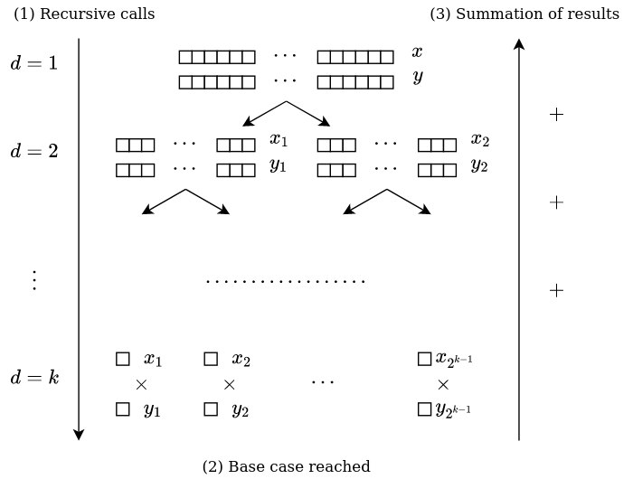
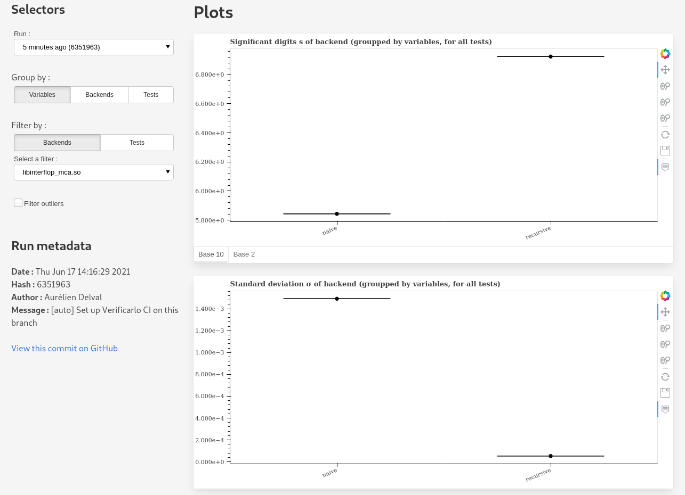

# vfc_ci_tutorial

This is a tutorial repository for the CI functionality of
[Verificarlo](https://github.com/verificarlo/verificarlo). It describes how to
setup the CI pipeline and generate the report on a simple example.

The goal of this example is to compute a basic dot product on two vectors
generated with a fixed random seed. The computation is done with a naive
method, and the function that does it can be found at the beginning of `main.c`.
The goal will be to use Verificarlo CI to measure the numerical accuracy of the
naive implementation, before adding a better version of the algorithm and
validating it by comparing the results of the two versions.

Following this tutorial will require you to have a
[functional install of Verificarlo](https://github.com/verificarlo/verificarlo/blob/master/doc/01-Install.md)
on your machine, or to use it through its
[Docker image](https://hub.docker.com/r/verificarlo/verificarlo/).

For more information on the tool itself, please refer to the
[Verificarlo CI documentation](https://github.com/verificarlo/verificarlo/blob/master/doc/06-Postprocessing.md#verificarlo-ci).
It is advised that you at least go through it quickly before doing this
tutorial.

## Steps to follow

### 1. Fork and clone the repository

In order to follow this tutorial, which makes use of Github Actions, you will
need to have your own fork of this repository. Once it is created, `git clone`
it :

```
❯ git clone https://github.com/[YourUserName]/verificarlo_ci_tutorial
❯ cd verificarlo_ci_tutorial
```

### 2. Try to build and execute the code

Here is the output that you should get after issuing the following commands :

```
❯ make
❯ ./dotprod
Naive dotprod = 1040.9039307
```

### 3. Add your first test probes

`vfc_probes` is the system used by Verificarlo CI to export test variables
from a program to the tool itself. First of all, you'll need to modify the
Makefile to link the `vfc_probes` library. Line 4 should become :

```
3    all:
4        $(CC) main.c -lvfc_probes -o dotprod
```

Moreover, you must also include the `vfc_probes.h` header at the beginning of
`main.c`.  You could add the following include statement after line 3 :

```
3    #include <time.h>
4 +  #include <vfc_probes.h>
```

Now that `vfc_probes` is correctly linked, we can create out probes structure.
This should be done at the beginning at the main function, for instance after
the new line 20 (if you added the previous line):

```
20    int main(void) {
21 +      vfc_probes probes = vfc_init_probes();
```

Then we will add the probe containing the result of the dotprod. You can
do this after the new line 32:

```
32        float naiveRes = naiveDotprod(x, y, n);
33 +      vfc_probe(&probes, "dotprod_test", "naive", naiveRes);
```

Finally, we can dump the probes at the end of the `main` function, just before
the return statement :

```
37 +      vfc_dump_probes(&probes);
38        return 0;
```

### 4. Set up vfc_ci and Github Actions

Before setting up Github Actions, we need to make sure that the `vfc_ci test`
command can run. To do this, create `vfc_tests_config.json`, the test
configuration file, at the root of the repository and with the following
content:

```
{
    "make_command": "make CC=verificarlo-c",
    "executables": [
        {
            "executable": "dotprod",
            "vfc_backends": [
                {
                    "name": "libinterflop_mca.so",
                    "repetitions": 20
                },
                {
                    "name": "libinterflop_mca.so --mode=rr",
                    "repetitions": 20
                }
            ]
        }
    ]
}

```

Each test run will consist of 40 executions of the dotprod executable, split
over two backends. This will export one test probe containing the result of the
naive dotprod. To make sure that everything works correctly, it is possible to
call `vfc_ci test` with the dry run flag, so that no output file will be
produced :

```
❯ vfc_ci test -d
[...]
Info [vfc_ci]: The results have been successfully written to XXXXXXXXXX.vfcrun.h5.
Info [vfc_ci]: The dry run flag was enabled, so no files were actually created.
```

If you get the following output, your Verificarlo CI setup should be correct.

Before setting up the CI workflow, we need to make sure that our local
repository doesn't contain any unstaged changes. Commit and push the changes
that you have just made :

```
❯ git add .
❯ git commit
❯ git push --set-upstream origin master
```

You are finally ready to create the CI workflow. This can be done automatically
with the following command :

```
❯ vfc_ci setup github
Info [vfc_ci]: A Verificarlo CI workflow has been setup on master.
Info [vfc_ci]: Make sure that you have a "vfc_tests_config.json" on this branch.
You can also perform a "vfc_ci test" dry run before pushing other commits.

```

This should create a commit on the `master` branch (which we will call the  
*dev* branch), as well as a `vfc_ci_master` branch (which we will call the *CI*
branch). A first test run will also be triggered immediately after the commit,
which will result in a test file being committed to the CI branch.

### 5. Serve the test report

Once the test file has been committed to the CI branch, you can checkout to it
and access the results :

```
❯ git checkout vfc_ci_master
❯ git pull origin vfc_ci_master
❯ cd vfcruns
❯ vfc_ci serve -s
```

... will open the report in your browser.

There's not much to see for now, since there's only one test variable and one
run in the report. However, if the naive algorithm could seem sufficient at
first glance, it does have one issue. The values of `x[i] * y[i]` are all
added to the same `res` variable, which will suffer from increasingly important
roundoff errors.  Thus, when a cancellation occurs, it will become catastrophic
and yield an inacurrate result. It has been showed that this error grows
in `O(n)`.


### 6. Adding an improved method

This section introduces another method for the computation of a dot product.
The idea is to recursively split the `x` and `y` arrays in half as to obtain
a binary tree, and to compute the `x[i] * y[i]` when the arrays are of size 1
(which is the base case). The final result is computed by adding for each node
the dot prods of its two children, until the root is reached. This method
is called [pairwise summation](https://en.wikipedia.org/wiki/Pairwise_summation)
and is illustrated in the figure below :



Since the results of each layer are added together instead of being accumulated
into one term, error will increase after each layer of the tree, instead of
after each operation, thus growing in `O(log n)` as shown in
[this article](https://www.maths.manchester.ac.uk/~higham/narep/narep198.pdf).


Here is the implementation of the algorithm that you can add before the `main`
function:

```
float recursiveDotprod(float * x, float * y, size_t n) {
	// NOTE This implementation assumes that N can be written as 2^k
	if((n & (n - 1)) != 0) {
		return 0;
	}

	// Base case
	if(n == 1) {
		return x[0] * y[0];
	}

	// Recursive case
	else {
		// Split array in 2 and do a recursive call for each half
		return recursiveDotprod(x, y, n / 2) +
			recursiveDotprod(&(x[n/2]), &(y[n/2]), n / 2);
	}
}
```

Call the function in `main.c` and add a new probe :

```
54
54 +      float recursiveRes = recursiveDotprod(x, y, n);
56 +      vfc_probe(&probes, "dotprod_test", "recursive", recursiveRes);
57 +

```
... and optionally a `printf` statement :

```
58    printf("Naive dotprod = %.7f \n", naiveRes);
59 +  printf("Recursive dotprod = %.7f \n", recursiveRes);
```

Finally, commit and push the changes to your remote repository. Optionally,
you can also run `vfc_ci test` yourself to generate a results file and directly
generate the report with `vfc_ci serve` (in which case only the results you have
just generated will appear, since the first results file is not in your work
tree).


### 7. Using the report to compare the two algorithms

Checkout to the CI branch and launch the test report just like in
[section 5](5.-serve-the-test-report). A second commit including the new test
probe should appear. In the "Inspect run" section, which allows to examine and
compare results from a single run, we should be able to compare the two
algorithms :

 

The following plots seem to validate our assumptions about the recursive
algorithm : the recursive version has both a higher number of significant digits
(around 6.9 vs 5.9 with `libinterflop_mca.so`) and a lower standard deviation
with both backends.

In this simple example, `vfc_ci` allowed us to quickly compare two algorithms
and confirm that our second one is numerically more stable than the naive
version. Of course, the proposed solution does not aim to be optimal, and you
can try to implement other methods such as the
[Kahan summation](https://en.wikipedia.org/wiki/Kahan_summation_algorithm) or
[Kobbelt's dot product algorithm](https://www.graphics.rwth-aachen.de/media/papers/dot_product.pdf).
